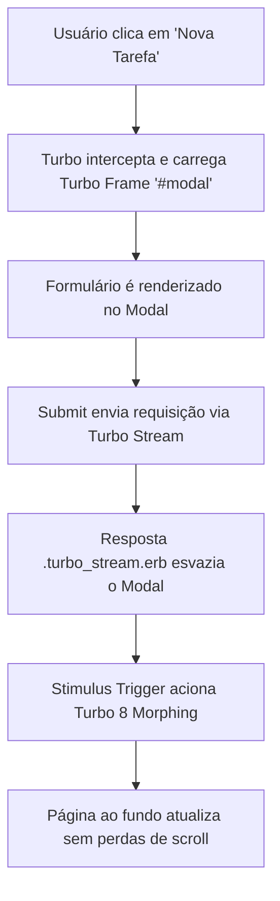
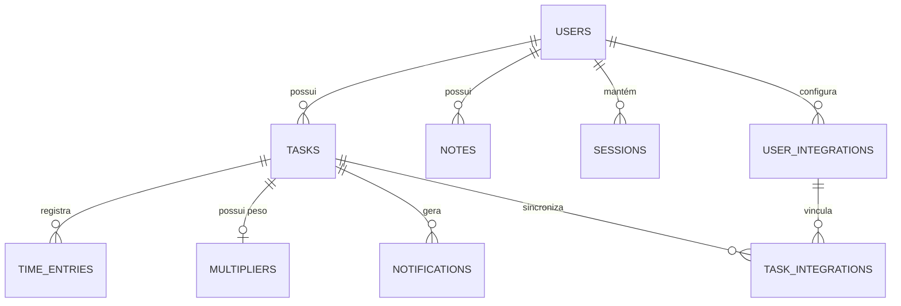

# 🏗️ Arquitetura & Stack Tecnológica - Azaleia

O **Azaleia** adota uma arquitetura inspirada no modelo *HTML-over-the-wire*, priorizando renderização server-side fluida com interações em tempo real sem a complexidade de um framework SPA (Single Page Application) tradicional.

---

## ⚡ Stack de Tecnologias

| Camada | Tecnologia | Descrição |
| :--- | :--- | :--- |
| **Backend** | Ruby 3.x / Rails 8.1+ | Framework MVC server-side principal |
| **Banco de Dados** | PostgreSQL / SQLite3 | Banco relacional normalizado |
| **Frontend UI** | Hotwire (Turbo 8 + Stimulus) | Reatividade nativa sem JS pesado |
| **Estilização** | Tailwind CSS | Utility-first CSS com suporte a Dark Mode |
| **Markdown** | Kramdown (GFM) | Renderização de notas e resumos formatados |
| **Documentação** | Âmbar Docs | Engine de documentação estática baseada em Markdown |

---

## 🔄 Fluxo de Modais & Turbo Frames

O Azaleia faz uso intensivo dos recursos do **Hotwire**:

---

## 🗄️ Modelo de Dados (Schema Simplificado)

O banco de dados do Azaleia é relacional e devidamente estruturado para suporte a multi-inquilino (multi-tenant) por usuário:

---

## 🚀 Pipeline de Deploy (CI/CD)

A entrega da aplicação é automatizada via **GitHub Actions** em uma infraestrutura conteinerizada:

1. **Build:** O GitHub Actions compila a imagem Docker do Rails e faz push para o GitHub Container Registry (`ghcr.io`).
2. **Deploy via SSH:** Os arquivos de orquestração (`docker-compose.yml`, `Caddyfile`) são copiados para a VPS.
3. **Database Migration:** Executa `docker compose run --rm web bin/rails db:prepare`.
4. **Reverse Proxy (Caddy):** O container Caddy atua como proxy reverso com HTTPS automático (Let's Encrypt), direcionando para a aplicação Rails na porta `8080`.
5. **Health Check:** O deploy verifica a rota `/up` antes de concluir a execução.
